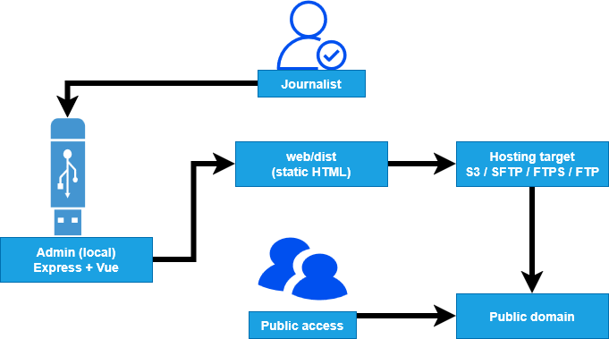
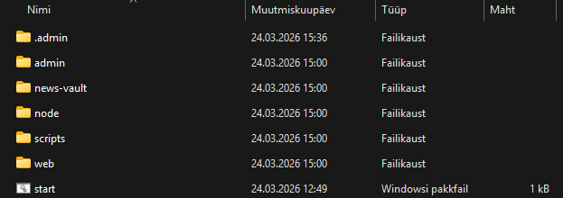

# Delfi EOD - Emergency Operation Portal

> For end-user usage instructions see [USER_MANUAL.md](USER_MANUAL.md).

## What is it

A crisis communication portal for Delfi. If primary infrastructure (AWS, Cloudflare, etc.) goes down, EOD provides a parallel static website on a separate domain (e.g. `eod.delfi.ee`) where editors can keep publishing updates.

The whole system runs off a hardware-encrypted USB stick. Plug it in, launch the start script, write articles, hit deploy. The public site is plain HTML - no backend needed to serve it.

## How it works



The admin is a local Express server (port 3001) with a Vue frontend. It reads/writes markdown files in `news-vault/`, rebuilds the Astro site into `web/dist/`, and uploads that to whichever hosting target is configured. The public site is entirely static - if admin goes down, the site stays up.

## Project structure

```
.
├── admin
│   ├── be                 # Express backend
│   │   ├── auth           # Password hashing, encryption, session auth
│   │   ├── data           # Article CRUD - reads/writes news-vault/
│   │   ├── routes         # articles, images, alert, server connection
│   │   └── utils          # Soft locks (remote), slugify, markdown
│   └── fe                 # Vue 3 + TypeScript frontend
│       ├── public
│       └── src
├── binaries               # Cached portable Node.js archives
├── img                    # README / manual screenshots
├── scripts
│   └── runtime            # Start scripts (start.bat, start.sh, start.command)
├── usb-runtime            # Built runtime output
│   ├── linux-x64
│   ├── macos-arm64
│   └── win-x64
└── web                    # Astro static site (public portal)
    ├── public
    │   └── fonts
    └── src
        ├── components     # Header, Footer, AlertBanner
        ├── layouts
        ├── pages          # index, [slug], contact
        └── styles
``` 

Not shown: `news-vault/` (article content, created at runtime), `.admin/` (password hash + encrypted credentials, created on first login), `dev.sh` (dev launcher).

## Developer setup

Requirements: Node.js v24+

**Option A - dev.sh (installs deps + starts both servers):**

```bash
chmod +x dev.sh    # first time only
./dev.sh
```

**Option B - manual:**

```bash
# Install deps
cd admin/be && npm install
cd ../fe && npm install
cd ../../web && npm install
cd ..

# Start backend
cd admin/be && npm run dev

# Start frontend (separate terminal)
cd admin/fe && npm run dev
```

This starts:
- Backend at `http://127.0.0.1:3001`
- Frontend at `http://127.0.0.1:5173`

To run the public site locally:

```bash
cd web && npm run dev
```

## Building the USB runtime

From the project root:

```
node scripts/build-runtime.mjs
```

This downloads portable Node.js binaries (with checksum verification), installs per-OS `node_modules` (so native deps like `sharp` work), builds `admin/fe/dist` and `web/dist`, and packages everything into three folders:

| Folder | OS | Start script |
|---|---|---|
| `usb-runtime/win-x64/` | Windows | `start.bat` |
| `usb-runtime/macos-arm64/` | macOS (Apple Silicon) | `start.command` |
| `usb-runtime/linux-x64/` | Linux | `start.sh` |



### Copying to USB

The USB drive must be formatted as **exFAT** - it's the only filesystem that works across Windows, macOS, and Linux out of the box.

If you know which OS the USB will be used on, copy just that folder to the drive. For a universal USB that works on any machine, copy all three - the user picks the appropriate folder.

Each runtime is self-contained: portable Node binary, pre-installed dependencies, built frontend, built public site. No internet or pre-installed Node required on the target machine.

## Deployment targets

The admin UI supports configuring multiple hosting targets:

- **S3** (or S3-compatible like MinIO, DigitalOcean Spaces)
- **SFTP** (SSH-based)
- **FTPS** (TLS-based)
- **FTP** (plain - warns about unencrypted credentials)


Each server can be tested and deployed to independently from the Server Connection view.


"Deploy" rebuilds `web/dist` and uploads it to the selected target. "Build Preview" only rebuilds locally so changes can be verified at `http://127.0.0.1:4321`.

## Security

**Admin is local-only.** It binds to `127.0.0.1` - not publicly accessible, no routes exposed to the internet. This is by design: the admin runs entirely off the USB stick, nothing is installed or written to the host machine. Since admin is never network-exposed, brute-force and rate limiting are unnecessary - there is no remote attack surface.

**Password handling:**
- Admin password is hashed with bcrypt (cost 12). The plaintext is never stored.
- The hash lives in `.admin/config.json`.

**Server credential storage:**
- Hosting credentials (S3 keys, SFTP/FTP passwords) are encrypted with AES-256-GCM.
- The encryption key is derived from the admin password via scrypt.
- Encrypted blob is stored in `.admin/credentials.enc`.
- Decrypted credentials exist only in memory while the session is active. They never leave `.admin/` in plaintext and are gone when the server stops.


**Sessions:**
- Express session with httpOnly cookie, 30-minute expiry, SameSite=lax.
- CSRF protection via custom header on state-changing requests.
- In-memory session store - all sessions disappear when the USB server stops.

**Input handling:**
- Article content is markdown rendered at build time by Astro - no user input is rendered at runtime, so XSS via the public site is not possible.
- Admin input is only accepted from the local authenticated session.

**Public site:**
- Static HTML/CSS/JS/images. No secrets, no backend, no API calls.
- No runtime code execution on the server side - nothing to inject into.
- Fully CDN-compatible (Cloudflare, CloudFront, Akamai, etc.).

**Caching:**
- Astro hashes asset filenames (CSS, JS) automatically - files in `_astro/` are served with `immutable` cache headers.
- HTML pages use `max-age=0, s-maxage=60, stale-while-revalidate=300` so updates propagate quickly while CDN edges still serve stale content during rebuilds.

## Content handling

Articles are stored as markdown files in `news-vault/`, one folder per article:

```
news-vault/
├── 2026-03-19-electricity-price-shock/
│   ├── live.md          # Published version (frontmatter + body)
│   └── media/           # Article images (auto-resized by sharp)
```

The admin writes to `news-vault/` directly. The Astro site reads from it via a glob loader in `content.config.ts`. Publishing triggers a rebuild + deploy.

**Soft locks:** When an editor opens an article, a lock file is written to the hosting target (`.locks/` directory). Other editors see the article is being edited. Locks expire after 30 minutes and refresh every 5 minutes while the editor is active.

**External links:** The header and footer both include a shared `SocialLinks` component (`web/src/components/SocialLinks.astro`) with placeholder links. Update the URLs in that single component to point to whatever Delfi considers essential (e.g. main site, social media, government crisis pages) - the change applies to both header and footer.

## Article editing features


- Title, lead text, lead image, body (markdown with EasyMDE editor), author, publish date
- Image upload with auto-resize (sharp) - both lead image and inline body images
- Publish / unpublish with automatic deploy
- Critical alert banner - toggle on/off, optionally change the text, then deploy with a button press
- Draft state tracking - shows "Published + Changes Pending" when edits haven't been deployed yet


## Migration under one hour

1. Have the USB runtime ready
2. Get credentials for a new hosting target from your ops/infrastructure team (or set one up yourself if you manage infra)
3. In admin: Server Connection → Add Server → enter credentials → Test → Deploy

DNS configuration is typically handled on the hosting target side (e.g. bucket policy, domain settings in the hosting panel).

The bottleneck is step 2 - the actual build and deploy has never taken more than two minutes in our testing and usually finishes under one (S3 deploys average 20-30 seconds). The site is static, so any hosting that serves files will work. No database, no runtime, no backend dependencies on the public side.

## Single points of failure

| Component | What if it fails? | Mitigation |
|---|---|---|
| USB stick | Can't edit/publish new content | Carry a second USB as backup; plug into any machine |
| Hosting target | Site goes down | Multiple targets can be configured; redeploy to another |
| DNS | Domain unreachable | Out of scope - coordinate with DNS provider |
| Node.js binary | Admin won't start | Bundled in USB runtime, verified with checksums |

## FAQ

**Can the public site work if admin is down?**
Yes. The public site is just static files. Admin is only needed for editing and deploying.

**Can editors work simultaneously?**
Yes. Soft locks warn when someone is already editing an article. Other articles and features remain usable. Locks are per-article, not global.

**Can I deploy to multiple hosts at once?**
Yes. Configure several servers and deploy to each. Useful for staging + production or for redundancy.

**How do I recover a forgotten password?**
You can't. Delete the `.admin/` folder and set up again. Server credentials will need to be re-entered.

**Can I add articles without the admin UI?**
Yes. Create a folder in `news-vault/` with a `live.md` file (frontmatter + markdown body) and rebuild.
