# EOD User Manual

This guide is for editors and operators - people who will use the portal to publish crisis updates. For developer/technical docs, see [README.md](README.md).

## Getting started

You should have a USB stick (or folder) with the EOD runtime for your operating system. Inside you'll find a start script:

| OS | File to open |
|---|---|
| Windows | `start.bat` (double-click) |
| macOS | `start.command` (double-click, may need to allow in Security settings) |
| Linux | `start.sh` (run in terminal) |

Once started, two addresses appear:

- **Admin portal:** `http://127.0.0.1:3001` - where you write and manage articles
- **Public site:** `http://127.0.0.1:4321` - local preview of what visitors will see

Open the admin portal in your browser.

## First-time setup

On first launch you'll be asked to create a password.

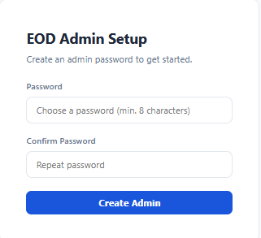

This password:

- Protects the admin interface
- Encrypts your hosting credentials on the USB stick (inside `.admin/`)
- Cannot be recovered if forgotten (you'd have to delete `.admin/` folder and start over)

Pick something strong (minimum 8 characters). You'll use it every time you open the portal admin.

## Logging in

Enter your password and click "Log In". The session lasts 30 minutes - after that you'll need to log in again.

## Writing an article

1. Click **"+ New Article"** on the dashboard
2. Fill in the fields:
   - **Title** (required) - the headline
   - **Lead** - short summary shown on the homepage
   - **Lead Image** - click "Upload Lead Image" to add a photo. Gets auto-resized.
   - **Lead Image Alt Text** - short description of the image (for accessibility / screen readers)
   - **Author** - optional, free text
   - **Publish Date** - defaults to now, change if needed
   - **Body** - the main content. Written in Markdown. The toolbar has bold, italic, headings, lists, links, and preview.
3. To add images inside the article body, use the 📷 Image button above the text editor
4. Click **Save**

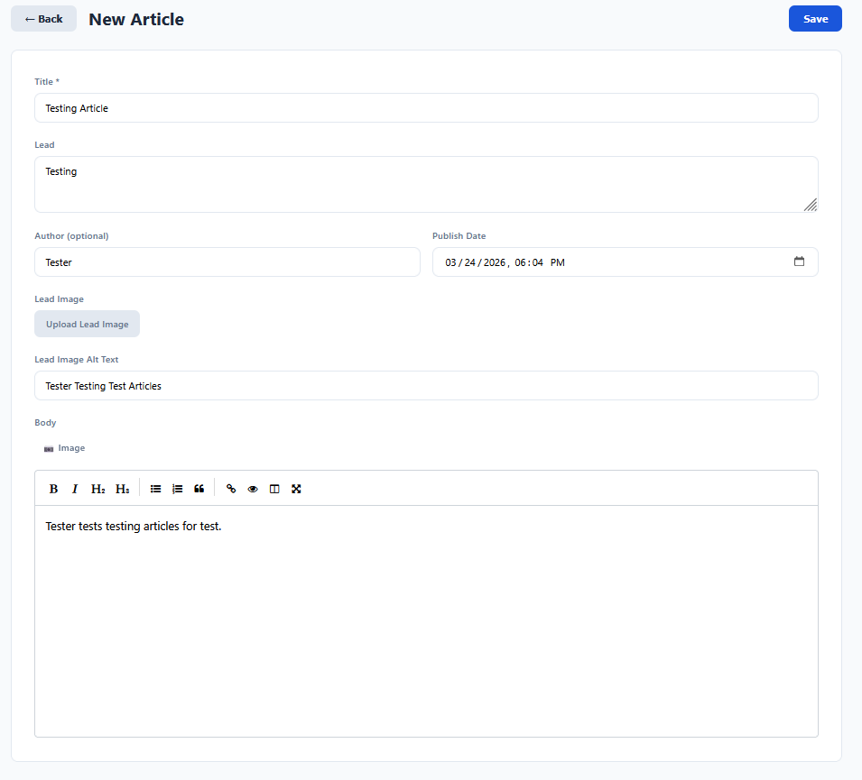

The article is saved as a draft. It's not published yet.

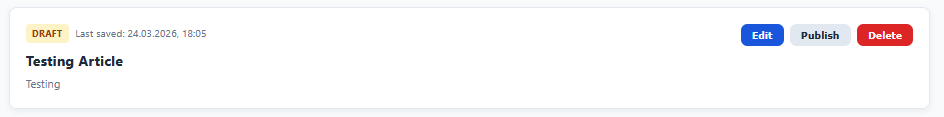

## Publishing

From the dashboard:

- **Draft articles** have a yellow "Draft" badge. Click **"Publish"** to publish.
- **Published articles** show a green "Published" badge. Click **"Unpublish"** to take them offline.
- If you edit a published article, it shows **"Published + Changes Pending"** - click **"Publish update"** to push the changes live.

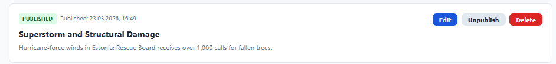

Publishing automatically rebuilds the public site and uploads it to your configured hosting target.

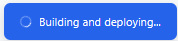
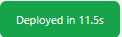

If deploy fails, an error banner appears with details:

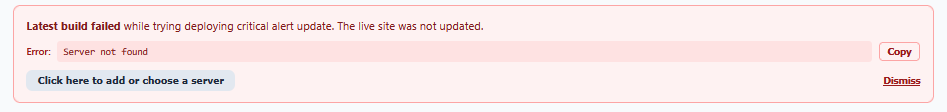

## Critical alert banner

The homepage can show a prominent alert banner at the top (e.g. "CRITICAL: Infrastructure outage in progress").

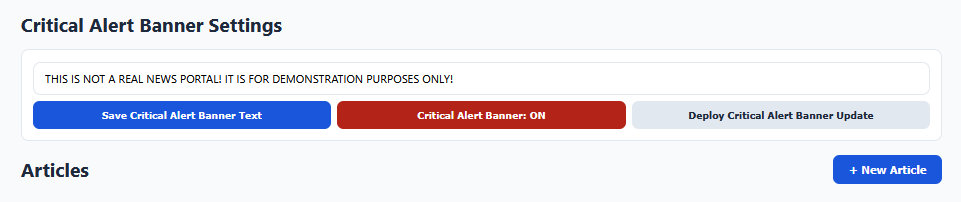

Click **"Activate Critical Alert"** on the dashboard to turn it on. Click again to deactivate. The change deploys immediately.

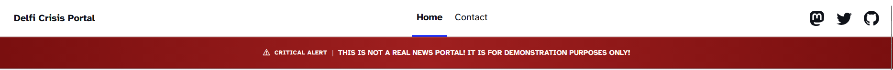

## Editing locks

When you open an article for editing, it gets locked so other editors know it's being worked on. The dashboard shows:

- **"Locked (this device)"** - you have it open on this machine
- **"Locked (other device)"** - someone else is editing it. You can't open it until they're done or the lock expires.

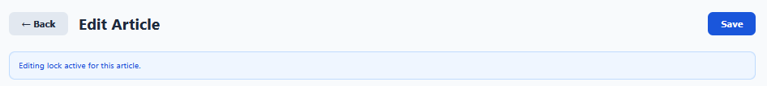
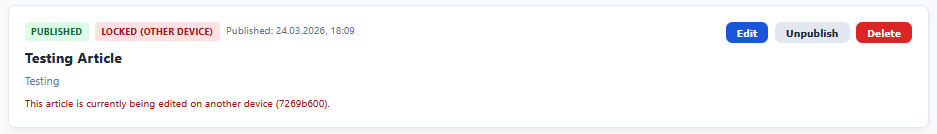

Locks expire automatically after **30 minutes** of inactivity. They refresh every 5 minutes while you're actively editing.

## Server connection (hosting target)

Before you can publish, you need at least one hosting target. Click **"⚙ Server"** in the top-right corner.

If no server is set as active, a banner reminds you:

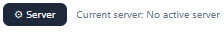

### Adding a server

1. Click **"+ Add Server"** (or the form appears automatically if none exist)
2. Give it a name (e.g. "Production", "Backup")
3. Pick the connection type:
   - **S3** - for AWS S3, MinIO, DigitalOcean Spaces, or similar
   - **SFTP (SSH)** - standard secure file transfer
   - **FTPS (TLS)** - FTP with encryption
   - **FTP** - plain FTP (not recommended - credentials sent unencrypted)
4. Fill in the connection details (host, credentials, remote path, etc.)
5. Click **Save**

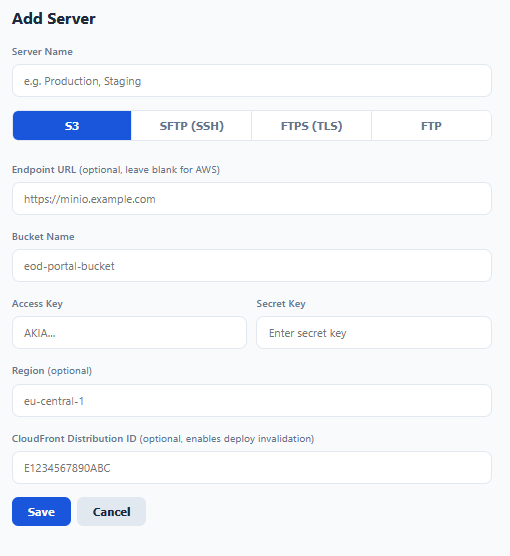

### Testing and deploying

- **Test** - checks if the connection works. Shows success/failure with response time.
- **Deploy** - rebuilds the public site and uploads everything to this server.
- **Build Preview** - rebuilds locally only (no upload) so you can check at `http://127.0.0.1:4321`

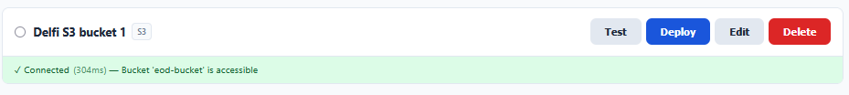

If the test fails, you'll see what went wrong:

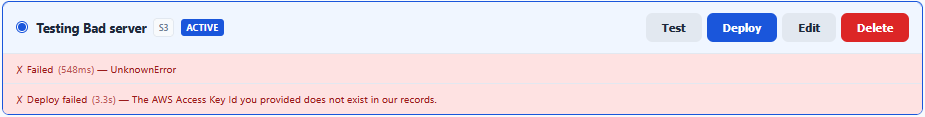

You can have multiple servers configured. Select which one is "Active" with the radio button - that's the one used when you publish or toggle alerts from the dashboard.

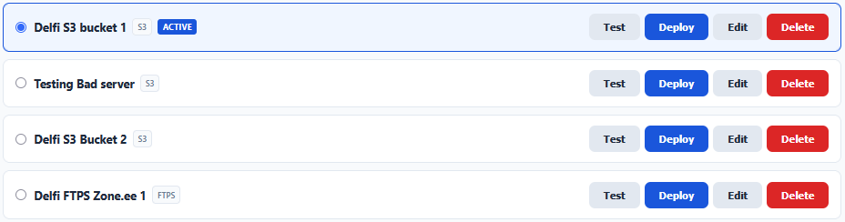
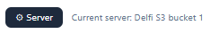

## Migrating to a new host

If your current hosting goes down and you need to switch:

1. Open Admin → Server Connection
2. Click "+ Add Server" and enter the new host's credentials
3. Test the connection
4. Deploy
5. Update DNS (A record or CNAME) on your domain to point to the new host

The site is fully static, so any host that can serve files will work. The build and deploy itself usually finishes under a minute - the main time goes into setting up the new host and entering credentials.

## Tips

- You can work offline - write and edit articles without a server connection. Just deploy when you're ready.
- The public site doesn't need the admin running. Once deployed, it stays up on its own.
- Nothing is installed on the host machine. Everything lives on the USB stick.
- If you forget your password, delete the `.admin/` folder in the runtime directory and restart. You'll need to re-enter your hosting credentials.
- Articles can also be written as markdown files directly in the `news-vault/` folder if you prefer a text editor.
