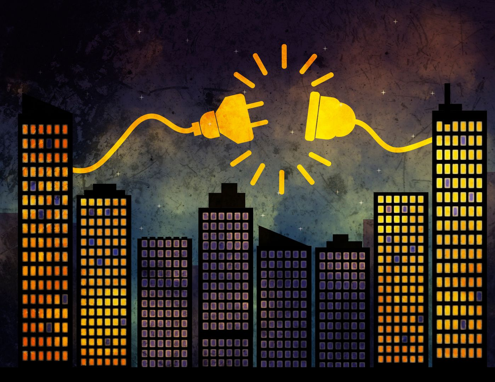
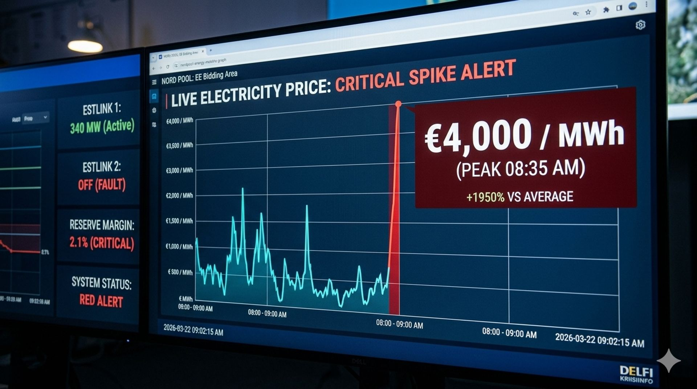

A combination of a Scandinavian subsea cable failure and calm winds has caused electricity prices to peak. System operator Elering requests residents to strictly limit consumption.

### Unprecedented Market Volatility

The Nord Pool energy exchange witnessed a historic anomaly this morning as the price for the Estonian bidding area hit the technical ceiling of **€4,000 per megawatt-hour**. This surge, occurring during the peak demand window between 8:00 and 9:00 AM, represents a nearly twenty-fold increase over the seasonal average. The crisis was triggered by a "perfect storm" of technical and environmental factors: a sudden cooling of the regional climate, a complete lack of wind for renewable generation, and a critical malfunction in the **Estlink 2** subsea cable connecting Estonia to the Finnish grid.

The cable failure, which occurred shortly after midnight, immediately cut off 650 MW of cheaper Nordic hydroelectric power. Without this vital artery, the regional market was forced to rely on expensive peak-load gas turbines and older oil-shale units. "We are operating in a deficit environment," explained **Jüri Maasikas**, a senior analyst at the energy watchdog. "When supply cannot meet demand, the market clearing price hits the maximum allowed threshold to force a reduction in consumption."

---

### Elering Issues Red Alert

System operator **Elering** has moved to a high-priority "Red Alert" status to protect the stability of the national grid. While a total blackout is not currently expected, the risk of localized brownouts remains high if the evening peak matches the morning surge. Residents are being urged to delay the use of high-energy appliances such as washing machines, dishwashers, and electric saunas.

Industrial consumers with flexible contracts have already begun powering down production lines to avoid catastrophic costs. For small businesses and households on exchange-based contracts, this single hour of peak pricing could result in a monthly bill increase of several hundred euros. The government is currently meeting to discuss potential emergency subsidies or price caps for the most vulnerable sectors of the economy.

| Time Slot     | Price per MWh | Status          |
| :------------ | :------------ | :-------------- |
| 08:00 - 09:00 | €4,000        | **Record Peak** |
| 12:00 - 13:00 | €1,200        | Very High       |
| 18:00 - 19:00 | €2,850        | Critical        |

---

### Seeking a Technical Solution

Repair crews are currently investigating the Estlink 2 failure, but underwater surveys are being hampered by rough sea conditions in the Gulf of Finland. Early telemetry suggests a structural fault in the converter station on the Estonian side, which may take several days to bypass or repair. In the meantime, the **Auvere** power plant has been ramped up to its absolute maximum capacity to compensate for the lost imports.

Energy experts warn that this shock is a wake-up call regarding the fragility of the Baltic energy island. As the region moves toward full desynchronization from the Russian power grid, the reliance on stable connections with Scandinavia becomes paramount. For now, Estonians are advised to keep a close eye on the "Tark Tarbija" (Smart Consumer) app and shift their electricity usage to the late-night hours when prices are expected to return to more manageable levels.

---
