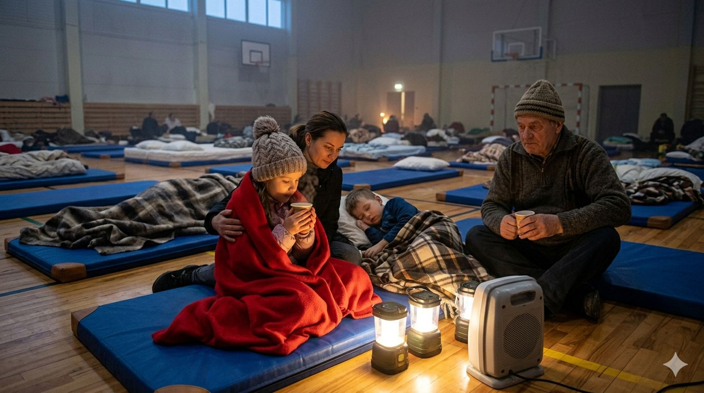

A main pipe burst at a local heat provider, causing apartment buildings to rapidly cool. The municipality has opened an emergency evacuation point at the local school.

### A Town Frozen in Time

The quiet municipality of **Karksi-Nuia** woke up to a silent emergency on Tuesday morning. A catastrophic failure occurred at the central boiler house on **Pargi Street**, plunging the entire district heat network into darkness. With outside temperatures hovering at **-12°C**, the 3,500 residents are facing a race against time. Inside the typical Soviet-era apartment blocks that dominate the town center, the radiators turned cold within an hour. "It's not just the cold; it's the speed," said **Mati Unt**, a retired engineer living on the fourth floor. "By 8 AM, I could see my breath in the kitchen."

Local authorities immediately mobilized, recognizing the severity of the situation for the town's vulnerable elderly population. Maintenance crews from **Eesti Soojus** were dispatched, but initial assessments were grim. The failure involves a massive fracture in the main 500mm outflow pipe, a critical artery that dates back to the late 1980s. A specialized repair team is en route from Tallinn, but they are not expected to arrive until late afternoon.

### Emergency Shelter and Community Response

Recognizing that many homes will become uninhabitable by nightfall, the municipality has activated its emergency response plan. The **Karksi-Nuia Gymnasium** on **Kooli Street** has been designated as the primary evacuation point. Volunteers have converted the large sports hall into a temporary shelter, laying out hundreds of mattresses and distributing wool blankets. The school kitchen, usually bustling with students, is now preparing hot soup and tea for displaced residents.

---

### Key Contact Information

| Location           | Purpose                         | Contact  |
| :----------------- | :------------------------------ | :------- |
| Gymnasium Shelter  | Immediate warmth, food          | 555-1234 |
| Municipal Helpline | Information, transport requests | 1247     |
| Eesti Soojus       | Status updates (Automated)      | 612-3000 |

---

The atmosphere in the gym is a mix of resilience and anxiety. While children find novelty in sleeping on gym mats, older residents worry about freezing pipes in their empty apartments. Local businesses have stepped up, with the town bakery donating fresh bread and a nearby gas station providing free coffee to emergency workers. The biggest concern remains the critical infrastructure, as a prolonged shutdown could lead to widespread burst pipes in individual homes, compounding the disaster.

The crisis in Karksi-Nuia highlights a growing issue across rural Estonia: aging, centralized heating systems that are prone to single-point failures. As night approaches and temperatures are forecast to drop even further, the speed of the repairs on Pargi Street is not just a logistical challenge—it is a matter of survival.

---
