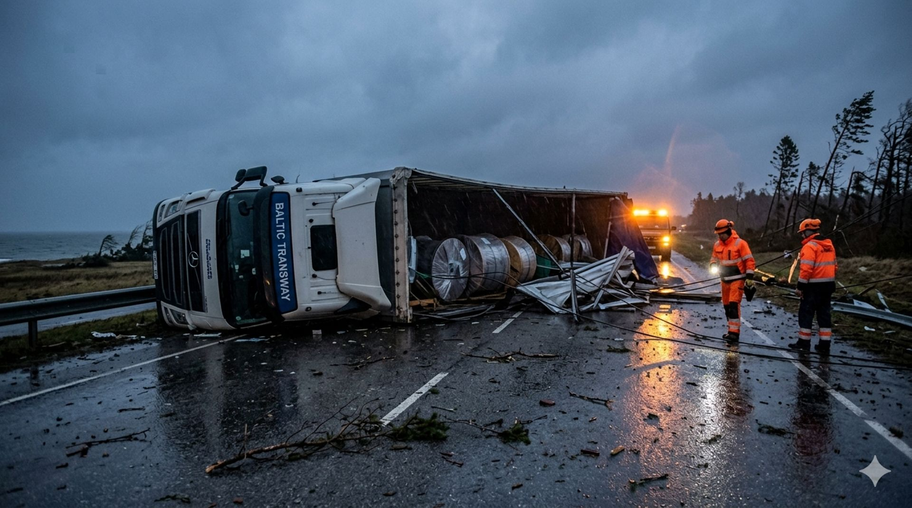
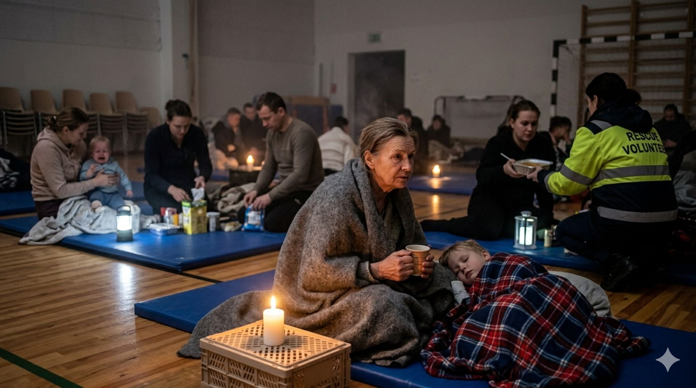

### Chaos in Valdoria: Coastal Town Bears the Brunt

The tranquil coastal town of Valdoria was transformed into a scene of structural devastation late Saturday night. Winds peaking at 145 km/h tore through the central district, leaving a trail of shattered glass and twisted metal. Mayor Lukas Männik described the sound as a "relentless freight train" passing through the town square. By midnight, the historic clock tower in the North Plaza had lost its copper plating to the gale.

Local resident Elena Kask witnessed her neighbor’s entire car shed lift into the air before disintegrating against a sturdy oak. "It happened so fast that we didn't even have time to move away from the windows," she recounted while clutching a flashlight. The Rescue Board confirmed that over 1,000 emergency calls regarding fallen trees were logged within a six-hour window. In the suburban sprawl of Linden Heights, a massive spruce crushed three parked vehicles simultaneously. Emergency crews are currently prioritizing life-threatening situations over property damage.

### Infrastructure Under Siege

The power grid has suffered its most significant blow in decades. Over 45,000 households are currently without electricity as high-voltage lines were snapped by flying debris. Repair teams from BalticGrid are standing by, but the wind remains too high for crane operations.

| Region | Reported Tree Falls | Estimated Power Outages |
| :--- | :--- | :--- |
| Valdoria Coast | 412 | 12,400 |
| Linden Heights | 289 | 8,200 |
| Central Estonia | 154 | 15,600 |
| South Forests | 145 | 8,800 |

Logistics have ground to a halt as the main artery connecting the north and south is blocked. A cargo truck was overturned near the Oru Junction, spilling non-hazardous materials across both lanes. Rail services have been suspended indefinitely until tracks can be cleared of pine branches and metal roofing. Communication remains spotty, with several mobile towers losing backup battery power. Authorities are using battery-operated radio stations to broadcast safety updates.

### A Community in Hiding

The directive remains clear: do not leave your home. Head of Emergency Services, Marten Saar, warned that the "lull" people are experiencing is merely the eye of the storm. Falling tiles and loose signage pose a lethal threat to anyone on the streets. Schools and community centers have been converted into temporary shelters for those whose roofs were compromised.

In the village of Veski, a local gym is now housing thirty families who fled rising waters. Volunteers are working by candlelight to distribute warm blankets and soup. The psychological toll is mounting as the darkness hides the extent of the wreckage. Experts estimate that the total economic impact will reach several million euros once the sky clears. For now, the nation waits in silence, listening to the wind howl against the brickwork.

Rescue dogs are on standby to search for anyone potentially trapped in the rubble of older wooden structures. No fatalities have been officially confirmed, though several injuries from flying glass were reported in the capital. The storm is expected to move toward the eastern border by Monday morning. Until then, Estonia remains under a red weather ale
